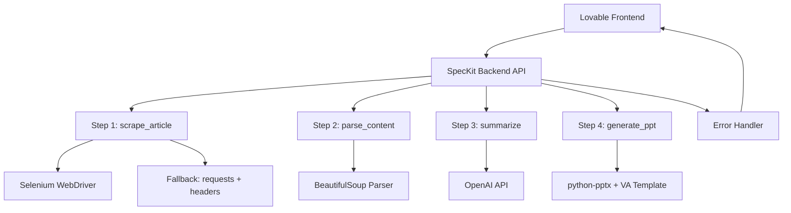

# JAMA VA Abstractor - Implementation Plan

## 🎯 Project Overview
Build a web application that extracts key details from JAMA articles and generates VA-style PowerPoint abstracts using the existing Lovable AI frontend connected to a SpecKit-powered backend pipeline.

## 🏗️ Architecture Overview



## 📋 Phase 1: Frontend Integration (Week 1)

### 1.1 Update Existing Components

#### **Input Components Enhancement**
```typescript
// Update src/components/FileUploadZone.tsx
interface FileUploadZoneProps {
  onFileSelect: (file: File) => void;
  onUrlSubmit: (url: string) => void; // Add URL support
  isProcessing: boolean;
  error?: string;
}
```

#### **Progress Tracker Component**
```typescript
// Create src/components/ProgressTracker.tsx
interface ProgressStep {
  id: string;
  name: string;
  status: 'pending' | 'processing' | 'completed' | 'error';
  message?: string;
}

const steps: ProgressStep[] = [
  { id: 'scrape', name: 'Scraping Article', status: 'pending' },
  { id: 'parse', name: 'Parsing Content', status: 'pending' },
  { id: 'summarize', name: 'AI Summarization', status: 'pending' },
  { id: 'generate', name: 'Creating PowerPoint', status: 'pending' }
];
```

#### **Results Panel Enhancement**
```typescript
// Update src/components/OutputPanel.tsx
interface VAResultsProps {
  results: {
    title: string;
    population: string;
    intervention: string;
    setting: string;
    primaryOutcome: string;
    findings: string[];
    author: string;
    date: string;
    doi: string;
    medicalIcon: string;
  };
  downloadUrl?: string;
  onDownload: () => void;
}
```

### 1.2 API Integration Updates

#### **Enhanced API Client**
```typescript
// Update src/services/api-client.ts
export interface ProcessingStatus {
  stepId: string;
  status: 'processing' | 'completed' | 'error';
  message: string;
  progress: number; // 0-100
}

export interface JAMAExtractionRequest {
  source: {
    type: 'url' | 'pdf';
    url?: string;
    file?: File;
  };
  options?: {
    includeReferences: boolean;
    templateStyle: 'standard' | 'clinical' | 'research';
  };
}
```

#### **Real-time Progress Updates**
```typescript
// Add WebSocket or Server-Sent Events support
export const useProgressTracking = (jobId: string) => {
  const [steps, setSteps] = useState<ProgressStep[]>([]);
  
  useEffect(() => {
    const eventSource = new EventSource(`/api/progress/${jobId}`);
    eventSource.onmessage = (event) => {
      const update: ProcessingStatus = JSON.parse(event.data);
      setSteps(prev => updateStepStatus(prev, update));
    };
    
    return () => eventSource.close();
  }, [jobId]);
  
  return steps;
};
```

## 🔧 Phase 2: SpecKit Backend Development (Week 2-3)

### 2.1 Project Structure
```
backend/
├── speckit/
│   ├── __init__.py
│   ├── config.py
│   ├── pipeline/
│   │   ├── __init__.py
│   │   ├── scraper.py
│   │   ├── parser.py
│   │   ├── summarizer.py
│   │   └── ppt_generator.py
│   ├── templates/
│   │   └── va_template.pptx
│   ├── utils/
│   │   ├── error_handler.py
│   │   └── validators.py
│   └── api/
│       ├── __init__.py
│       ├── routes.py
│       └── models.py
├── requirements.txt
├── docker-compose.yml
└── .env
```

### 2.2 Core Pipeline Implementation

#### **Step 1: Article Scraper**
```python
# backend/speckit/pipeline/scraper.py
import asyncio
from selenium import webdriver
from selenium.webdriver.chrome.options import Options
import requests
from typing import Dict, Any, Optional

class JAMAScraper:
    def __init__(self):
        self.chrome_options = Options()
        self.chrome_options.add_argument("--headless")
        self.chrome_options.add_argument("--no-sandbox")
        self.chrome_options.add_argument("--disable-dev-shm-usage")
        
    async def scrape_article(self, url: str) -> Dict[str, Any]:
        """
        Scrape JAMA article with fallback strategies
        """
        try:
            # Primary: Selenium approach
            return await self._scrape_with_selenium(url)
        except Exception as selenium_error:
            try:
                # Fallback: Direct HTTP with headers
                return await self._scrape_with_requests(url)
            except Exception as requests_error:
                return {
                    "success": False,
                    "error": "scraping_failed",
                    "message": f"Both scraping methods failed: {str(selenium_error)}, {str(requests_error)}",
                    "step": "scrape_article"
                }
    
    async def _scrape_with_selenium(self, url: str) -> Dict[str, Any]:
        driver = None
        try:
            driver = webdriver.Chrome(options=self.chrome_options)
            driver.get(url)
            
            # Wait for content to load
            await asyncio.sleep(3)
            
            html_content = driver.page_source
            
            return {
                "success": True,
                "html_content": html_content,
                "url": url,
                "method": "selenium"
            }
        finally:
            if driver:
                driver.quit()
    
    async def _scrape_with_requests(self, url: str) -> Dict[str, Any]:
        headers = {
            'User-Agent': 'Mozilla/5.0 (Windows NT 10.0; Win64; x64) AppleWebKit/537.36 (KHTML, like Gecko) Chrome/91.0.4472.124 Safari/537.36',
            'Accept': 'text/html,application/xhtml+xml,application/xml;q=0.9,image/webp,*/*;q=0.8',
            'Accept-Language': 'en-US,en;q=0.5',
            'Accept-Encoding': 'gzip, deflate',
            'Connection': 'keep-alive',
            'Upgrade-Insecure-Requests': '1'
        }
        
        response = requests.get(url, headers=headers, timeout=30)
        response.raise_for_status()
        
        return {
            "success": True,
            "html_content": response.text,
            "url": url,
            "method": "requests"
        }
```

#### **Step 2: Content Parser**
```python
# backend/speckit/pipeline/parser.py
from bs4 import BeautifulSoup
import re
from typing import Dict, Any, Optional
import logging

class JAMAParser:
    def __init__(self):
        self.logger = logging.getLogger(__name__)
        
    def parse_content(self, html_content: str, url: str) -> Dict[str, Any]:
        """
        Extract structured data from JAMA article HTML
        """
        try:
            soup = BeautifulSoup(html_content, 'html.parser')
            
            extracted_data = {
                "title": self._extract_title(soup),
                "authors": self._extract_authors(soup),
                "date": self._extract_publication_date(soup),
                "doi": self._extract_doi(soup),
                "abstract": self._extract_abstract(soup),
                "population": self._extract_population(soup),
                "intervention": self._extract_intervention(soup),
                "setting": self._extract_setting(soup),
                "primary_outcome": self._extract_primary_outcome(soup),
                "findings": self._extract_findings(soup),
                "full_text": self._extract_full_text(soup)
            }
            
            # Validate extraction quality
            quality_score = self._calculate_quality_score(extracted_data)
            
            return {
                "success": True,
                "data": extracted_data,
                "quality_score": quality_score,
                "step": "parse_content"
            }
            
        except Exception as e:
            return {
                "success": False,
                "error": "parsing_failed",
                "message": f"Failed to parse article content: {str(e)}",
                "step": "parse_content"
            }
    
    def _extract_title(self, soup: BeautifulSoup) -> Optional[str]:
        # Multiple selectors for title
        selectors = [
            'h1.meta-article-title',
            '.article-title',
            'h1[data-testid="article-title"]',
            'meta[property="og:title"]'
        ]
        
        for selector in selectors:
            element = soup.select_one(selector)
            if element:
                return element.get_text(strip=True) if element.name != 'meta' else element.get('content')
        
        return None
    
    def _extract_population(self, soup: BeautifulSoup) -> Optional[str]:
        # Look for population information in methods section
        methods_section = soup.find(['div', 'section'], class_=re.compile(r'methods|participants', re.I))
        if methods_section:
            # Extract population details using NLP patterns
            text = methods_section.get_text()
            population_patterns = [
                r'(\d+)\s+(?:patients|participants|subjects|individuals)',
                r'(?:patients|participants|subjects)\s+(?:aged|age)\s+([\d\-\s]+)',
                r'inclusion criteria[:\s]+(.*?)(?:exclusion|methods|results)',
            ]
            
            for pattern in population_patterns:
                match = re.search(pattern, text, re.IGNORECASE | re.DOTALL)
                if match:
                    return match.group(0)[:200]  # Limit length
        
        return None
    
    def _calculate_quality_score(self, data: Dict[str, Any]) -> float:
        """Calculate extraction quality score (0-1)"""
        required_fields = ['title', 'population', 'intervention', 'findings']
        found_fields = sum(1 for field in required_fields if data.get(field))
        return found_fields / len(required_fields)
```

#### **Step 3: AI Summarizer**
```python
# backend/speckit/pipeline/summarizer.py
import openai
from typing import Dict, Any, List
import json

class AISummarizer:
    def __init__(self, api_key: str):
        openai.api_key = api_key
        self.word_limits = {
            "title": 15,
            "population": 25,
            "intervention": 30,
            "setting": 20,
            "primary_outcome": 25,
            "findings": 40
        }
        
    async def summarize(self, extracted_data: Dict[str, Any]) -> Dict[str, Any]:
        """
        Summarize extracted data to meet VA template requirements
        """
        try:
            # Prepare summarization prompts
            summaries = {}
            
            for field, word_limit in self.word_limits.items():
                if extracted_data.get(field):
                    summary = await self._summarize_field(
                        field, 
                        extracted_data[field], 
                        word_limit
                    )
                    summaries[field] = summary
            
            # Select appropriate medical icon
            medical_icon = await self._select_medical_icon(extracted_data)
            
            return {
                "success": True,
                "summaries": summaries,
                "medical_icon": medical_icon,
                "step": "summarize"
            }
            
        except Exception as e:
            return {
                "success": False,
                "error": "summarization_failed",
                "message": f"AI summarization failed: {str(e)}",
                "step": "summarize"
            }
    
    async def _summarize_field(self, field_name: str, content: str, word_limit: int) -> str:
        prompt = f"""
        Summarize the following {field_name} information for a VA-style medical abstract.
        Keep it to {word_limit} words maximum.
        Focus on the most clinically relevant information.
        
        Content: {content[:1000]}  # Limit input length
        
        Summary:
        """
        
        response = await openai.ChatCompletion.acreate(
            model="gpt-3.5-turbo",
            messages=[{"role": "user", "content": prompt}],
            max_tokens=word_limit * 2,
            temperature=0.3
        )
        
        return response.choices[0].message.content.strip()
    
    async def _select_medical_icon(self, data: Dict[str, Any]) -> str:
        """Select appropriate medical icon based on content"""
        content = f"{data.get('title', '')} {data.get('intervention', '')} {data.get('findings', '')}"
        
        icon_prompt = f"""
        Based on this medical study content, select the most appropriate icon category:
        
        Content: {content[:500]}
        
        Available icons:
        - cardiology (heart conditions, cardiovascular)
        - neurology (brain, nervous system)
        - oncology (cancer, tumors)
        - infectious_disease (infections, antibiotics)
        - surgery (surgical procedures)
        - pharmacy (medications, drugs)
        - general_medicine (general medical conditions)
        
        Return only the category name:
        """
        
        response = await openai.ChatCompletion.acreate(
            model="gpt-3.5-turbo",
            messages=[{"role": "user", "content": icon_prompt}],
            max_tokens=20,
            temperature=0.1
        )
        
        return response.choices[0].message.content.strip().lower()
```

#### **Step 4: PowerPoint Generator**
```python
# backend/speckit/pipeline/ppt_generator.py
from pptx import Presentation
from pptx.util import Inches, Pt
from pptx.dml.color import RGBColor
from pptx.enum.text import PP_ALIGN
import os
from typing import Dict, Any

class VAPowerPointGenerator:
    def __init__(self, template_path: str):
        self.template_path = template_path
        self.icon_mappings = {
            'cardiology': '🫀',
            'neurology': '🧠',
            'oncology': '🎗️',
            'infectious_disease': '🦠',
            'surgery': '🏥',
            'pharmacy': '💊',
            'general_medicine': '⚕️'
        }
    
    def generate_ppt(self, summaries: Dict[str, str], medical_icon: str) -> Dict[str, Any]:
        """
        Generate VA-style PowerPoint presentation
        """
        try:
            # Load VA template
            prs = Presentation(self.template_path)
            
            # Get the first slide (assuming single slide template)
            slide = prs.slides[0]
            
            # Fill in the template placeholders
            self._fill_title_slide(slide, summaries, medical_icon)
            
            # Save presentation
            output_path = f"/tmp/va_abstract_{hash(str(summaries))}.pptx"
            prs.save(output_path)
            
            return {
                "success": True,
                "file_path": output_path,
                "file_size": os.path.getsize(output_path),
                "step": "generate_ppt"
            }
            
        except Exception as e:
            return {
                "success": False,
                "error": "ppt_generation_failed",
                "message": f"PowerPoint generation failed: {str(e)}",
                "step": "generate_ppt"
            }
    
    def _fill_title_slide(self, slide, summaries: Dict[str, str], medical_icon: str):
        """Fill VA template with summarized content"""
        
        # Define placeholder mappings
        placeholder_mappings = {
            0: summaries.get('title', 'Study Title'),
            1: f"{self.icon_mappings.get(medical_icon, '⚕️')} {summaries.get('population', 'Population details')}",
            2: summaries.get('intervention', 'Intervention details'),
            3: summaries.get('setting', 'Study setting'),
            4: summaries.get('primary_outcome', 'Primary outcome'),
            5: summaries.get('findings', 'Key findings')
        }
        
        # Fill placeholders
        for idx, content in placeholder_mappings.items():
            if idx < len(slide.placeholders):
                placeholder = slide.placeholders[idx]
                placeholder.text = content
                
                # Apply VA styling
                if placeholder.has_text_frame:
                    text_frame = placeholder.text_frame
                    for paragraph in text_frame.paragraphs:
                        paragraph.alignment = PP_ALIGN.LEFT
                        for run in paragraph.runs:
                            run.font.name = 'Calibri'
                            run.font.size = Pt(14)
                            run.font.color.rgb = RGBColor(0, 32, 96)  # VA Blue
```

### 2.3 API Routes & Error Handling

#### **Main API Routes**
```python
# backend/speckit/api/routes.py
from fastapi import FastAPI, HTTPException, BackgroundTasks, UploadFile, File
from fastapi.responses import FileResponse, StreamingResponse
import asyncio
import uuid
from typing import Dict, Any
import json

app = FastAPI(title="JAMA VA Abstractor API")

# In-memory job tracking (use Redis in production)
jobs = {}

@app.post("/api/extract")
async def extract_article(
    background_tasks: BackgroundTasks,
    url: str = None,
    file: UploadFile = File(None)
):
    """
    Start article extraction process
    """
    job_id = str(uuid.uuid4())
    
    if url:
        source = {"type": "url", "url": url}
    elif file:
        source = {"type": "pdf", "filename": file.filename}
        # Save uploaded file
        file_path = f"/tmp/{job_id}_{file.filename}"
        with open(file_path, "wb") as f:
            content = await file.read()
            f.write(content)
        source["file_path"] = file_path
    else:
        raise HTTPException(status_code=400, detail="Either URL or file must be provided")
    
    # Initialize job
    jobs[job_id] = {
        "status": "started",
        "steps": [
            {"id": "scrape", "status": "pending", "message": "Waiting to start"},
            {"id": "parse", "status": "pending", "message": "Waiting to start"},
            {"id": "summarize", "status": "pending", "message": "Waiting to start"},
            {"id": "generate", "status": "pending", "message": "Waiting to start"}
        ],
        "source": source,
        "result": None,
        "error": None
    }
    
    # Start background processing
    background_tasks.add_task(process_article, job_id)
    
    return {"job_id": job_id, "status": "started"}

@app.get("/api/progress/{job_id}")
async def get_progress(job_id: str):
    """
    Get job progress (for SSE streaming)
    """
    if job_id not in jobs:
        raise HTTPException(status_code=404, detail="Job not found")
    
    def generate_progress():
        while True:
            if job_id in jobs:
                job = jobs[job_id]
                yield f"data: {json.dumps(job)}\n\n"
                
                if job["status"] in ["completed", "failed"]:
                    break
            time.sleep(1)
    
    return StreamingResponse(generate_progress(), media_type="text/plain")

@app.get("/api/download/{job_id}")
async def download_ppt(job_id: str):
    """
    Download generated PowerPoint file
    """
    if job_id not in jobs:
        raise HTTPException(status_code=404, detail="Job not found")
    
    job = jobs[job_id]
    if job["status"] != "completed" or not job.get("result", {}).get("file_path"):
        raise HTTPException(status_code=400, detail="File not ready")
    
    file_path = job["result"]["file_path"]
    return FileResponse(
        file_path,
        media_type="application/vnd.openxmlformats-officedocument.presentationml.presentation",
        filename=f"va_abstract_{job_id}.pptx"
    )

async def process_article(job_id: str):
    """
    Background task to process article through pipeline
    """
    try:
        job = jobs[job_id]
        pipeline = JAMAPipeline()
        
        # Step 1: Scraping
        job["steps"][0]["status"] = "processing"
        job["steps"][0]["message"] = "Scraping article content..."
        
        if job["source"]["type"] == "url":
            scrape_result = await pipeline.scraper.scrape_article(job["source"]["url"])
        else:
            # Handle PDF processing here
            scrape_result = {"success": False, "error": "PDF processing not implemented"}
        
        if not scrape_result["success"]:
            raise Exception(scrape_result["message"])
        
        job["steps"][0]["status"] = "completed"
        job["steps"][0]["message"] = "Article scraped successfully"
        
        # Step 2: Parsing
        job["steps"][1]["status"] = "processing"
        job["steps"][1]["message"] = "Parsing article content..."
        
        parse_result = pipeline.parser.parse_content(
            scrape_result["html_content"], 
            job["source"].get("url", "")
        )
        
        if not parse_result["success"]:
            raise Exception(parse_result["message"])
            
        job["steps"][1]["status"] = "completed"
        job["steps"][1]["message"] = f"Content parsed (Quality: {parse_result['quality_score']:.1%})"
        
        # Step 3: Summarization
        job["steps"][2]["status"] = "processing"
        job["steps"][2]["message"] = "AI summarization in progress..."
        
        summary_result = await pipeline.summarizer.summarize(parse_result["data"])
        
        if not summary_result["success"]:
            raise Exception(summary_result["message"])
            
        job["steps"][2]["status"] = "completed"
        job["steps"][2]["message"] = "Content summarized successfully"
        
        # Step 4: PowerPoint Generation
        job["steps"][3]["status"] = "processing"
        job["steps"][3]["message"] = "Generating PowerPoint presentation..."
        
        ppt_result = pipeline.ppt_generator.generate_ppt(
            summary_result["summaries"],
            summary_result["medical_icon"]
        )
        
        if not ppt_result["success"]:
            raise Exception(ppt_result["message"])
            
        job["steps"][3]["status"] = "completed"
        job["steps"][3]["message"] = "PowerPoint generated successfully"
        
        # Mark job as completed
        job["status"] = "completed"
        job["result"] = {
            "summaries": summary_result["summaries"],
            "medical_icon": summary_result["medical_icon"],
            "file_path": ppt_result["file_path"],
            "quality_score": parse_result["quality_score"]
        }
        
    except Exception as e:
        job["status"] = "failed"
        job["error"] = str(e)
        
        # Mark current step as failed
        for step in job["steps"]:
            if step["status"] == "processing":
                step["status"] = "error"
                step["message"] = f"Failed: {str(e)}"
                break
```

## 🚀 Phase 3: Integration & Testing (Week 4)

### 3.1 Frontend-Backend Integration

#### **Update useExtraction Hook**
```typescript
// Update src/hooks/useExtraction.ts
export const useExtraction = () => {
  const [jobId, setJobId] = useState<string | null>(null);
  const [steps, setSteps] = useState<ProgressStep[]>([]);
  const [result, setResult] = useState<ExtractionResult | null>(null);
  const [error, setError] = useState<string | null>(null);

  const startExtraction = async (source: { type: 'url' | 'pdf'; url?: string; file?: File }) => {
    try {
      const formData = new FormData();
      if (source.type === 'url') {
        formData.append('url', source.url!);
      } else {
        formData.append('file', source.file!);
      }

      const response = await fetch('/api/extract', {
        method: 'POST',
        body: formData,
      });

      const { job_id } = await response.json();
      setJobId(job_id);
      
      // Start listening to progress updates
      startProgressTracking(job_id);
    } catch (err) {
      setError(err instanceof Error ? err.message : 'Failed to start extraction');
    }
  };

  const startProgressTracking = (jobId: string) => {
    const eventSource = new EventSource(`/api/progress/${jobId}`);
    
    eventSource.onmessage = (event) => {
      const job = JSON.parse(event.data);
      setSteps(job.steps);
      
      if (job.status === 'completed') {
        setResult(job.result);
        eventSource.close();
      } else if (job.status === 'failed') {
        setError(job.error);
        eventSource.close();
      }
    };
  };

  return {
    startExtraction,
    steps,
    result,
    error,
    isProcessing: jobId !== null && !result && !error,
  };
};
```

### 3.2 Deployment Configuration

#### **Docker Compose Setup**
```yaml
# docker-compose.yml
version: '3.8'

services:
  frontend:
    build: 
      context: .
      dockerfile: Dockerfile.frontend
    ports:
      - "3000:3000"
    environment:
      - VITE_API_BASE_URL=http://backend:8000
    depends_on:
      - backend

  backend:
    build:
      context: ./backend
      dockerfile: Dockerfile
    ports:
      - "8000:8000"
    environment:
      - OPENAI_API_KEY=${OPENAI_API_KEY}
      - SELENIUM_HUB_URL=http://selenium:4444
    depends_on:
      - selenium
      - redis
    volumes:
      - ./backend/templates:/app/templates

  selenium:
    image: selenium/standalone-chrome:latest
    ports:
      - "4444:4444"
    shm_size: 2gb

  redis:
    image: redis:alpine
    ports:
      - "6379:6379"
```

#### **Backend Dockerfile**
```dockerfile
# backend/Dockerfile
FROM python:3.9-slim

WORKDIR /app

# Install system dependencies
RUN apt-get update && apt-get install -y \
    gcc \
    g++ \
    && rm -rf /var/lib/apt/lists/*

# Install Python dependencies
COPY requirements.txt .
RUN pip install --no-cache-dir -r requirements.txt

# Copy application code
COPY . .

# Expose port
EXPOSE 8000

# Start application
CMD ["uvicorn", "speckit.api.routes:app", "--host", "0.0.0.0", "--port", "8000"]
```

## 📋 Phase 4: Error Handling & Optimization (Week 5)

### 4.1 Comprehensive Error Handling

#### **Frontend Error Display**
```typescript
// src/components/ErrorDisplay.tsx
interface ErrorDisplayProps {
  error: string;
  step?: string;
  onRetry?: () => void;
  onSupport?: () => void;
}

export const ErrorDisplay: React.FC<ErrorDisplayProps> = ({ 
  error, 
  step, 
  onRetry, 
  onSupport 
}) => {
  const getErrorMessage = (error: string, step?: string) => {
    const errorMessages = {
      'scraping_failed': 'Unable to access the JAMA article. Please check the URL or try again later.',
      'parsing_failed': 'Could not extract information from the article. The content may be in an unsupported format.',
      'summarization_failed': 'AI summarization service is temporarily unavailable.',
      'ppt_generation_failed': 'PowerPoint generation failed. Please try again.',
    };
    
    return errorMessages[error] || 'An unexpected error occurred. Please try again.';
  };

  return (
    <div className="bg-red-50 border border-red-200 rounded-lg p-4">
      <div className="flex items-center">
        <AlertCircle className="h-5 w-5 text-red-400 mr-2" />
        <h3 className="text-sm font-medium text-red-800">
          {step ? `Error in ${step}` : 'Processing Error'}
        </h3>
      </div>
      <div className="mt-2 text-sm text-red-700">
        {getErrorMessage(error, step)}
      </div>
      <div className="mt-4 flex space-x-2">
        {onRetry && (
          <button
            onClick={onRetry}
            className="bg-red-100 text-red-800 px-3 py-2 rounded text-sm hover:bg-red-200"
          >
            Try Again
          </button>
        )}
        {onSupport && (
          <button
            onClick={onSupport}
            className="bg-gray-100 text-gray-800 px-3 py-2 rounded text-sm hover:bg-gray-200"
          >
            Contact Support
          </button>
        )}
      </div>
    </div>
  );
};
```

### 4.2 Performance Optimizations

#### **Caching Strategy**
```python
# backend/speckit/utils/cache.py
import redis
import json
from typing import Any, Optional
import hashlib

class CacheManager:
    def __init__(self, redis_url: str):
        self.redis_client = redis.from_url(redis_url)
        self.default_ttl = 3600  # 1 hour
    
    def get_article_cache(self, url: str) -> Optional[Dict[str, Any]]:
        """Get cached article data"""
        cache_key = f"article:{hashlib.md5(url.encode()).hexdigest()}"
        cached_data = self.redis_client.get(cache_key)
        
        if cached_data:
            return json.loads(cached_data)
        return None
    
    def set_article_cache(self, url: str, data: Dict[str, Any], ttl: int = None):
        """Cache article data"""
        cache_key = f"article:{hashlib.md5(url.encode()).hexdigest()}"
        self.redis_client.setex(
            cache_key, 
            ttl or self.default_ttl, 
            json.dumps(data)
        )
```

## 📊 Phase 5: Testing & Quality Assurance (Week 6)

### 5.1 Test Implementation

#### **Backend Tests**
```python
# backend/tests/test_pipeline.py
import pytest
import asyncio
from speckit.pipeline.scraper import JAMAScraper
from speckit.pipeline.parser import JAMAParser

class TestJAMAPipeline:
    @pytest.fixture
    def scraper(self):
        return JAMAScraper()
    
    @pytest.fixture
    def parser(self):
        return JAMAParser()
    
    @pytest.mark.asyncio
    async def test_scrape_valid_url(self, scraper):
        url = "https://jamanetwork.com/journals/jama/fullarticle/2812345"  # Mock URL
        result = await scraper.scrape_article(url)
        
        assert result["success"] is True
        assert "html_content" in result
        assert len(result["html_content"]) > 0
    
    def test_parse_article_content(self, parser):
        sample_html = """
        <html>
            <h1 class="meta-article-title">Test Article Title</h1>
            <div class="methods">Study included 500 patients aged 18-65</div>
        </html>
        """
        
        result = parser.parse_content(sample_html, "test_url")
        
        assert result["success"] is True
        assert result["data"]["title"] == "Test Article Title"
        assert "500 patients" in result["data"]["population"]
```

#### **Frontend Tests**
```typescript
// src/tests/useExtraction.test.tsx
import { renderHook, act } from '@testing-library/react-hooks';
import { useExtraction } from '../hooks/useExtraction';
import fetchMock from 'jest-fetch-mock';

describe('useExtraction', () => {
  beforeEach(() => {
    fetchMock.resetMocks();
  });

  it('should start extraction with URL', async () => {
    fetchMock.mockResponseOnce(JSON.stringify({ job_id: 'test-job-123' }));
    
    const { result } = renderHook(() => useExtraction());
    
    await act(async () => {
      await result.current.startExtraction({ 
        type: 'url', 
        url: 'https://jamanetwork.com/test' 
      });
    });
    
    expect(fetchMock).toHaveBeenCalledWith('/api/extract', {
      method: 'POST',
      body: expect.any(FormData),
    });
    
    expect(result.current.isProcessing).toBe(true);
  });
});
```

## 🎯 Success Metrics & Monitoring

### Key Performance Indicators
- **Processing Success Rate**: > 95%
- **Average Processing Time**: < 2 minutes
- **User Satisfaction**: > 4.5/5
- **Error Recovery Rate**: > 90%

### Monitoring Setup
```python
# backend/speckit/utils/monitoring.py
import logging
import time
from functools import wraps

def monitor_step(step_name: str):
    def decorator(func):
        @wraps(func)
        async def wrapper(*args, **kwargs):
            start_time = time.time()
            try:
                result = await func(*args, **kwargs)
                duration = time.time() - start_time
                
                logging.info(f"Step {step_name} completed in {duration:.2f}s")
                return result
            except Exception as e:
                duration = time.time() - start_time
                logging.error(f"Step {step_name} failed after {duration:.2f}s: {str(e)}")
                raise
        return wrapper
    return decorator
```

## 📝 Documentation & Deployment

### Environment Setup
```bash
# Development setup
git clone https://github.com/Arliiii/jama-va-abstractor
cd jama-va-abstractor

# Install frontend dependencies
npm install
npm run dev

# Setup backend
cd backend
pip install -r requirements.txt
uvicorn speckit.api.routes:app --reload

# Production deployment
docker-compose up -d
```

### Configuration Files
```env
# .env
OPENAI_API_KEY=your_openai_api_key
REDIS_URL=redis://localhost:6379
SELENIUM_HUB_URL=http://localhost:4444
VA_TEMPLATE_PATH=./templates/va_template.pptx
```

This comprehensive implementation plan provides a complete roadmap for building your JAMA VA Abstractor with the existing Lovable frontend and a robust SpecKit-powered backend pipeline. Each phase builds upon the previous one, ensuring a systematic and manageable development process.
